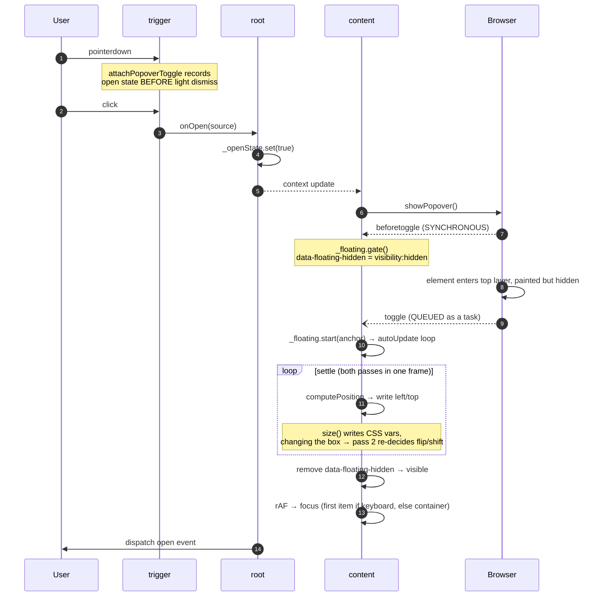
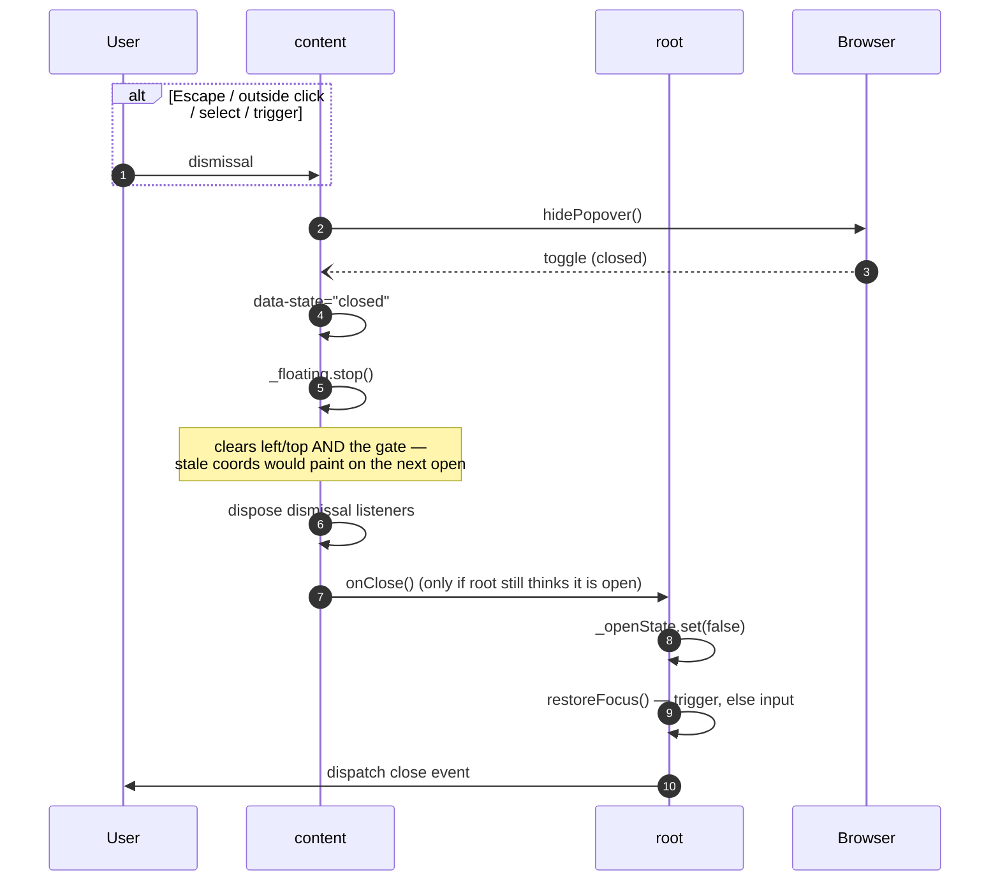

# Anatomy of an overlay component

Every overlay in this library — dropdown, select, combobox, tooltip, dialog,
alert dialog — runs the same sequence: **activate → gate → reveal → position →
settle → focus**, and its mirror on close. The parts differ; the shape does not.

This document describes that shared flow once, then lists only where each
component deviates. If you are adding an overlay, or debugging one that flickers,
misplaces itself, or steals focus, start here.

For the specific bugs this sequence was designed to avoid, see
[`COMPONENT_FIXES.md`](./COMPONENT_FIXES.md).

---

## The cast

| Part | Job |
|---|---|
| `*-root` | Owns state, provides context, dispatches events. Never renders UI beyond a `<slot>`. |
| `*-trigger` | Turns a user gesture into an intent to open or close. Owns nothing. |
| `*-content` | The overlay surface. Owns positioning, its own dismissal, and where focus lands. |
| `*-item` | Reflects state as `data-*` attributes. Reports selection upward. |

Roots talk to children through `@lit/context`, never by reaching into them.
Children talk to the root through context callbacks, never by mutating it.

## Two source-of-truth models

Worth knowing which one you're in, because it changes where you look when
something desyncs.

**A. The native element is the truth** — `dropdown`.
The popover's own open/closed state is authoritative. The root *observes* it via
the `toggle` event and mirrors it into `isOpen`. Nothing sets `isOpen` directly.

**B. The root is the truth** — `select`, `combobox`, `tooltip`, `dialog`.
The root owns a `ControlledState`, and the content reacts to context changes by
calling `showPopover()` / `hidePopover()` (or `showModal()` / `close()`). The
native element follows.

Model B is what you want for anything with controlled-mode support, because a
consumer-supplied `open` prop has to be able to win.

---

## The open sequence

### Why each step is where it is

**The gate must be set from `beforetoggle`, not `toggle`.** `showPopover()`
reveals the element synchronously, but its `toggle` event is *queued as a task*.
Gating from `toggle` lets a frame paint at stale coordinates. `beforetoggle`
fires synchronously, before the browser paints.

**Positioning runs twice.** `size()`'s `apply` writes custom properties that
change the floating element's own box — which invalidates the `flip()` / `shift()`
decisions made against the pre-resize box, and separately trips `autoUpdate`'s
`ResizeObserver`. Both `computePosition` calls resolve in microtasks, so they land
in the same frame and cost nothing perceptible.

**Focus depends on how it was opened.** A keyboard open focuses the first item; a
mouse open focuses the *container*. Focus has to leave the trigger either way, or
arrow keys never reach the content's keydown handler — but landing on the
container means no item paints a focus ring the user didn't ask for. The trigger
communicates this through a `data-open-source` attribute, because the `toggle`
event carries no such information.

> **The failure mode to design against:** a gate that never lifts is worse than no
> gate — the element is open, in the top layer, and invisible. Every path that
> skips positioning (no anchor resolved, a thrown measurement) must lift it
> explicitly.

---

## The close sequence

**One owner for return-focus.** It belongs to the root, because the root owns the
close. Two owners means focus visibly hops between them, and with `open-on-focus`
the second focus reopens what was just closed.

**Return focus only when it would be stranded.** If the user closed the overlay by
clicking something else, focus has already legitimately moved — pulling it back
steals it from where they aimed. Check `document.activeElement` in a `rAF` before
restoring.

---

## Dismissal: `auto` vs `manual`

A `popover="auto"` light-dismisses for free, but its notion of "inside" is the
popover **plus its registered invoker** — and only `<button>` and `<input>` can be
invokers. A custom element never can be.

Two consequences, and the two strategies that follow:

**Use `auto` + `attachPopoverToggle`** when clicking the trigger while open should
close. The helper reads the open state at `pointerdown`, before light dismiss
runs, so the click that follows can't reopen what the browser just closed.

**Use `manual` + `attachDismiss`** when some element *outside* the overlay must
not dismiss it — a combobox's text input being the case in point. You then own
the boundary, and must reproduce Escape handling yourself (including
`stopPropagation`, so a combobox inside a dialog doesn't close both).

---

## Where each component deviates

| Component | Native primitive | Truth | Notable deviation |
|---|---|---|---|
| `dropdown` | `popover="auto"` | popover | Only component where the native element owns state; root has no `ControlledState`. Focus target depends on `data-open-source`. |
| `select` | `popover="auto"` | root | Focus moves to the selected item on open, not the first. |
| `combobox` | `popover="manual"` | root | Owns dismissal via `attachDismiss` so clicks in the input don't close it. Filters items by toggling `style.display`. Highlight is tracked separately from focus, which stays in the input (`aria-activedescendant`). |
| `tooltip` | `popover="manual"` | root | No `toggle` listener at all — shows/hides directly from `willUpdate`, so it gates inline before `showPopover()`. Adds `hide({ referenceHidden })` and drives inline `visibility` itself. |
| `dialog` | native `<dialog>` | root | No popover, no floating-ui. `showModal()` vs `show()` per the `modal` property. Derives from `_isOpen` vs `_lastSyncedOpen` rather than reading `changedProperties`. |
| `alert-dialog` | native `<dialog>` | root | As dialog, but always modal and has no light dismiss by design — a destructive confirmation should require an explicit choice. |
| `toast` | none | store | Not an overlay in this sense: a plain positioned list driven by a module-level store, no anchor and no trigger. |

`accordion`, `tabs`, `switch` and `avatar` have no overlay at all — they use the
root/context/`data-*` parts of the architecture without any of this sequence.

---

## Checklist for a new overlay

1. Pick a truth model. If it needs controlled mode, the root owns it.
2. Use `FloatingController`. Call `gate()` from `beforetoggle`, `start()` from
   `toggle`, `stop()` on close.
3. Make sure **every** path that skips positioning lifts the gate.
4. Wire the trigger with `attachPopoverToggle` — never a bare `click` handler
   calling `showPopover()`.
5. Decide dismissal: `auto` if the boundary is just the overlay, `manual` +
   `attachDismiss` if anything outside it counts as inside.
6. Give the root sole ownership of return-focus, and only when focus would
   otherwise be stranded.
7. Distinguish keyboard from pointer opens before moving focus.
8. Reflect state as `data-state` / `data-side` / `data-align` so consumers can
   style and animate. Ship no opinions.
9. Namespace and dispatch events through `dispatch()` from core.
